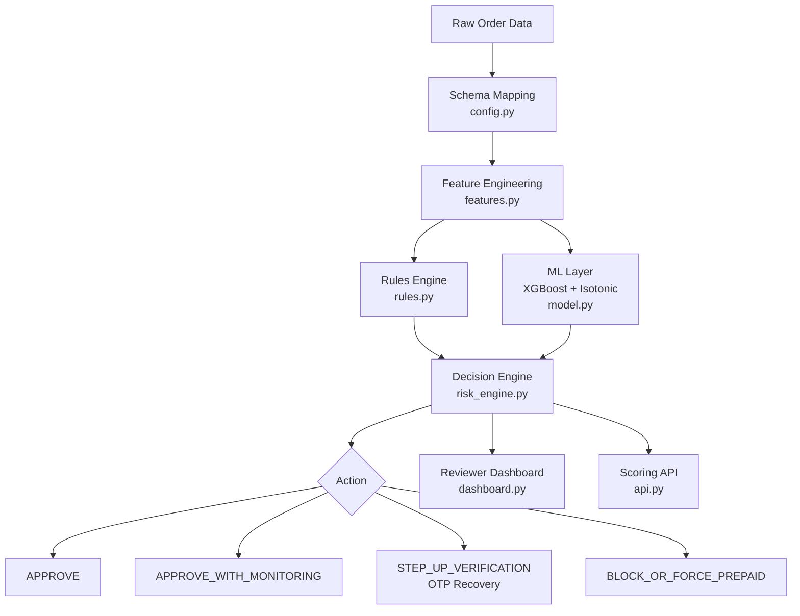

# AI Risk Manager — Schema-Driven Payment Fraud & Ring Detection


An enterprise-grade, cost-aware AI risk engine built for the **Razorpay AI Buildathon (Track 02: AI Risk Manager)**. The system combines deterministic business rules, graph-lite entity ring detection, calibrated XGBoost machine learning, IsolationForest anomaly scoring, and dynamic risk-band decisioning with step-up verification recovery paths.

---

## 1. Problem Framing & Dataset Context

While the original track prompt focuses on Cash-on-Delivery (COD) refusal and promo-abuse detection, live production e-commerce COD datasets with ground-truth refusal labels are proprietary. To rigorously validate the system on real-world transactional behavior rather than purely synthetic noise, this pipeline was trained and evaluated on the **IEEE-CIS Fraud Detection dataset** (590,540 real transaction records from Kaggle).

Because IEEE-CIS is a financial payment-fraud dataset:
- `phone` and `promo_code` fields are not present in the raw source and are left empty in `data/processed/output.csv`.
- The dataset measures real card-payment fraud (`isFraud`) across card numbers, device fingerprints (`DeviceInfo`), and billing/shipping addresses (`addr1`, `addr2`).

**Why this is a strength:** The core architecture — schema mapping, velocity tracking, graph-lite entity ring detection, calibrated ML scoring, cost-optimized decisioning, step-up recovery paths, and trust decay — is **100% schema-driven and domain-agnostic**. The pipeline logic remains identical whether evaluating payment fraud, COD refusal, or promo abuse. The moment `phone` and `promo_code` fields are provided in an incoming payload, the corresponding velocity and ring rules activate automatically.

---

## 2. System Architecture

The project consists of 8 modular components designed for end-to-end auditability and low-latency execution:



1. **Schema-Driven Ingestion (`src/config.py`)**: Maps arbitrary raw CSV columns to a fixed internal schema (`order_id`, `customer_id`, `device_id`, `address_id`, `phone`, `promo_code`, `order_amount`, `payment_method`, `order_timestamp`, `account_created_at`, `label_fraud`).
2. **Feature Engineering (`src/features.py`)**: Computes rolling velocity windows (1h, 24h, 7d), account age, consistency ratios, customer lifetime value (`customer_lifetime_value_proxy`), and graph-lite ring detection features (`distinct_customer_id_per_device_id_prior`). All calculations use strictly backward-looking expanding windows to guarantee zero data leakage.
3. **Deterministic Rules Engine (`src/rules.py`)**: Evaluates high-precision rule conditions (device rings, address clusters, promo velocity, new-account promo abuse, COD velocity, extreme amounts). Rule severities (`high`, `medium`, `low`) escalate risk bands proportionally without overriding low-risk ML scores to `very_high`.
4. **ML Layer (`src/model.py`)**: Trains an XGBoost classifier with Isotonic Regression for probability calibration. Includes an IsolationForest model for unsupervised anomaly scoring. All splits are strictly time-based (train: 389,756 / val: 100,392 / test: 100,392).
5. **Decision Engine (`src/risk_engine.py`)**: Synthesizes rule severities, calibrated risk scores, anomaly scores, and customer trust adjustments into actionable decisions (`APPROVE`, `APPROVE_WITH_MONITORING`, `STEP_UP_VERIFICATION`, `BLOCK_OR_FORCE_PREPAID`). Incorporates recovery paths (e.g., OTP verification for `STEP_UP_VERIFICATION`) and a trust-decay mechanic for customers with past cleared flags.
6. **Cost-Based Evaluation (`src/evaluate.py`)**: Evaluates performance using business cost metrics (weighing missed fraud vs. customer-value-weighted false declines vs. manual review vs. RTO costs) rather than arbitrary classification accuracy. Produces threshold tables, insult rate metrics, and ablation studies.
7. **Reviewer Dashboard (`src/dashboard.py`)**: A Streamlit console providing a flagged-order queue ranked by risk score, detailed reason codes, step-up verification path indicators, insult rate panel, and human-in-the-loop review actions (Approve/Hold/Block).
8. **Scoring API (`src/api.py`)**: A FastAPI web service exposing `POST /score` (single order), `POST /score_batch` (batch scoring), and `GET /health` endpoints.

---

## 3. Real Evaluation Results

Evaluated on the held-out test set of **100,392 orders** (chronologically strictly after the training and validation sets):

- **Headline Insult Rate**: **0.01% (0.0001)** — At the optimal cost-minimizing threshold (0.75), only 7 out of 96,952 legitimate customers were falsely flagged.
- **PR-AUC (Precision-Recall Area Under Curve)**: **0.1689**
  - *Context*: The baseline fraud rate in IEEE-CIS is **~3.5%**, meaning a random classifier yields a PR-AUC of **~0.035**. This model achieves **~5x better than random chance** while using only 11 clean schema columns and engineered features, deliberately avoiding black-box column-stacking over all 393 raw Kaggle features.
- **Optimal Decision Threshold**: **0.75** (selected by minimizing expected financial cost in ₹).
- **Expected Financial Cost at Optimal Threshold**: **₹33,87,413** (down from ₹43,407,366 at default 0.05 threshold).
- **Ablation Comparison (Validation PR-AUC)**:

| Model Stage | PR-AUC | Notes |
|---|---|---|
| Rules-Only Baseline | 0.038 | Precision 3.8%, Recall 100% |
| ML Base (no graph) | 0.1971 | |
| Full Model (ML + Graph-Lite) | 0.2163 | +0.0192 from graph features |

### Test Set Action Distribution

| Action | Count |
|---|---|
| `APPROVE_WITH_MONITORING` | 100,193 |
| `STEP_UP_VERIFICATION` | 128 (triggers OTP verification) |
| `BLOCK_OR_FORCE_PREPAID` | 67 |
| `APPROVE` | 4 |

---

## 4. Project Directory Layout

```text
Razorpay_builthon/
├── .streamlit/
│   └── config.toml             # Custom warm light theme styling
├── artifacts/
│   ├── decisions_sample.json   # 50 stratified sample decision records for dashboard
│   └── trained_model.pkl       # Serialized XGBoost + Isotonic + IsolationForest model
├── data/
│   ├── processed/
│   │   ├── output.csv          # Preprocessed training dataset (590,540 rows)
│   │   └── smoke_test_data.csv # Synthetic test dataset (1,758 rows)
│   └── raw/
│       ├── train_identity.csv  # Raw Kaggle IEEE-CIS identity table (25 MB)
│       └── train_transaction.csv # Raw Kaggle IEEE-CIS transaction table (651 MB)
├── docs/
│   └── SCHEMA.md               # Pipeline data schema documentation
├── src/
│   ├── api.py                  # FastAPI scoring service
│   ├── config.py               # Column mapping, cost model, risk bands & recovery paths
│   ├── dashboard.py            # Streamlit reviewer console
│   ├── evaluate.py             # Cost-based evaluation, insult rate & ablation logic
│   ├── features.py             # Feature engineering & graph-lite ring tracking
│   ├── model.py                # Time-based splitting, model training & calibration
│   ├── preprocess_ieee.py      # Raw IEEE-CIS data mapper script
│   ├── risk_engine.py          # Combined rule + ML decision engine
│   ├── rules.py                # Deterministic rule definitions
│   └── train.py                # End-to-end training orchestrator script
├── make_smoke_test_data.py     # Generator for synthetic test dataset
├── README.md                   # Project documentation
└── requirements.txt            # Python dependencies
```

---

## 5. How to Run

### Setup Environment
```bash
# Activate your virtual environment (e.g. venv)
.\venv\Scripts\activate

# Install dependencies
pip install -r requirements.txt
```

### 1. Train & Evaluate the Model
Run the end-to-end pipeline using `output.csv`:
```bash
python src/train.py data/processed/output.csv
```
This will train XGBoost, calibrate probabilities, run the ablation study, output the cost evaluation table, and save artifacts (`artifacts/trained_model.pkl` and `artifacts/decisions_sample.json`).

### 2. Launch the Reviewer Console (Dashboard)
```bash
streamlit run src/dashboard.py
```
Open `http://localhost:8501` to view the flagged order queue, recovery paths, insult rate metrics, and model status.

### 3. Launch the Scoring API
```bash
uvicorn src.api:app --reload --port 8000
```
- Test Health: `GET http://127.0.0.1:8000/health`
- Batch Scoring: `POST http://127.0.0.1:8000/score_batch`

---

## 6. Adaptation to Live Production COD & Promo Data

The pipeline already contains full support for phone velocity features (`velocity_phone_24h`), promo velocity features (`velocity_promo_code_24h`), promo abuse rules (`PROMO_VELOCITY_001`, `NEW_ACCOUNT_PROMO_RING`), and COD velocity rules (`COD_VELOCITY_001`). When deployed in a production environment where `phone` numbers and `promo_code` strings are passed in order payloads, these features and rules automatically calculate without requiring any code modifications to the engine.

---

## 7. Defensive Scope Statement

This software system is strictly defense-only. It is built exclusively for fraud detection, risk scoring, transaction decisioning, and reviewer auditability. It does not contain, generate, or expose any offense-capable logic, automated fraud generation, or security bypass capabilities.
